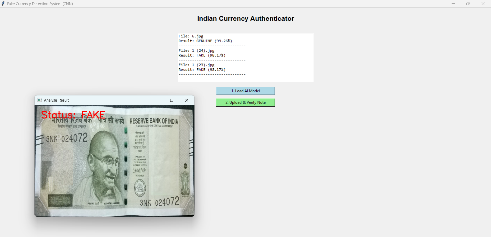

# 💸 Indian Currency Authenticator: Fake Note Detection using CNN

A Deep Learning-based desktop application to identify counterfeit Indian banknotes using Convolutional Neural Networks (CNN). Built and trained on the **Mahatma Gandhi New Series** dataset, the system achieves **97.68% training accuracy** and **96.50% validation accuracy** in distinguishing real from fake currency.

[](https://python.org)
[](https://tensorflow.org)
[](https://keras.io)

---

## 🚀 Project Overview

Counterfeit currency is a significant threat to financial systems and everyday consumers. This project provides a fully software-based solution to verify the authenticity of Indian banknotes across 6 denominations — ₹10, ₹50, ₹100, ₹200, ₹500, and ₹2000.

By leveraging **Computer Vision** and **Deep Learning**, the system analyzes subtle visual security features in currency images that are often invisible to the human eye — making it a viable prototype for banking, retail, and fintech applications.

---

## ✨ Key Features

- **Custom CNN Architecture:** Built from scratch using TensorFlow/Keras — no pretrained model dependency
- **High Accuracy:** Achieves 97.68% training accuracy and 96.50% validation accuracy with minimal overfitting gap
- **Real-Time GUI:** User-friendly Tkinter desktop application for instant image-based note verification
- **Multi-Denomination Support:** Handles all 6 denominations of the Mahatma Gandhi New Series
- **Hierarchical Data Processing:** Automatically navigates deep folder structures for different denomination datasets

---

## 🧠 Model Architecture

A custom sequential CNN was designed and trained from scratch:

| Layer | Details |
|-------|---------|
| Input | 128 × 128 × 3 (RGB Images) |
| Conv Layer 1-3 | Convolutional layers with ReLU activation for feature extraction |
| Pooling Layers | Max-pooling to reduce spatial dimensions and computation |
| Dropout Layer | 0.5 dropout rate to prevent overfitting |
| Output Layer | Sigmoid activation for Binary Classification (Real vs. Fake) |

---

## 📊 Model Performance

The model was trained on **5,954 images** across 10 epochs:

```
Epoch 10/10
187/187 ━━━━━━━━━━━━━━━━━━━━ 45s 241ms/step
loss: 0.0610 - accuracy: 0.9768 - val_loss: 0.0812 - val_accuracy: 0.9650
```

**Key Observations:**
- Training accuracy: **97.68%** | Validation accuracy: **96.50%**
- The small gap between training and validation accuracy (1.18%) confirms the model generalizes well to unseen data with no significant overfitting
- Low training loss of **0.0610** indicates strong feature learning from currency security patterns

---

## 📸 Live Testing (GUI)

The desktop application allows users to load any currency note image and instantly receive an authenticity verdict. Below is a test result for a ₹500 note correctly identified as **Fake**.



---

## 🛠️ Tech Stack

| Tool | Usage |
|------|-------|
| Python 3.10+ | Core programming language |
| TensorFlow 2.16+ / Keras 3 | CNN model building and training |
| OpenCV (cv2) | Image loading and preprocessing |
| Tkinter | Desktop GUI application |
| Kaggle Dataset | Indian Currency Real vs Fake image dataset (5,954 images, 8GB) |

---

## 📂 Project Structure

```
Fake_Currency_Detection_using_Deep_Learning/
├── dataset/                          # Real/Fake image folders per denomination
├── project_screenshots/              # GUI and result screenshots
├── model/
│   ├── model.json                    # Saved CNN architecture
│   └── model_weights_h5_file_link.txt  # Link to trained model weights
├── fake_currency_detection_using_CNN.pdf  # Full project documentation
├── train_model.py                    # CNN training script
├── main.py                           # GUI application entry point
├── requirements.txt                  # Python dependencies
└── README.md
```

---

## ⚙️ Setup & Execution

**1. Clone the repository**
```bash
git clone https://github.com/keerthikr2002/Fake_Currency_Detection_using_Deep_Learning.git
cd Fake_Currency_Detection_using_Deep_Learning
```

**2. Install dependencies**
```bash
pip install -r requirements.txt
```

**3. Train the model**
```bash
python train_model.py
```

**4. Launch the GUI application**
```bash
python main.py
```

> **Note:** First-time training may take time depending on hardware. GPU (CUDA) support will significantly speed up training.

---

## 🔍 What I Learned

- Designing and training a CNN architecture from scratch for a real-world binary classification problem
- Understanding the impact of Dropout layers in preventing overfitting on imbalanced image datasets
- Evaluating model performance using training vs. validation accuracy gap as an overfitting indicator
- Building a complete end-to-end ML pipeline from raw image data to a production-ready desktop application
- Handling large-scale hierarchical image datasets (8GB) with automated folder traversal in Python

---

## 🎯 Real-World Applications

- **Banking & ATMs:** Automated counterfeit detection at cash deposit/withdrawal points
- **Retail & Commerce:** Point-of-sale currency verification for merchants
- **Fintech Prototyping:** Foundation for mobile-based currency authentication apps

---

*Built by Keerthi ch | [GitHub Profile](https://github.com/keerthikr2002)*
